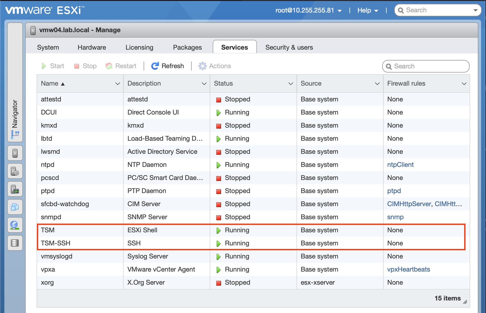
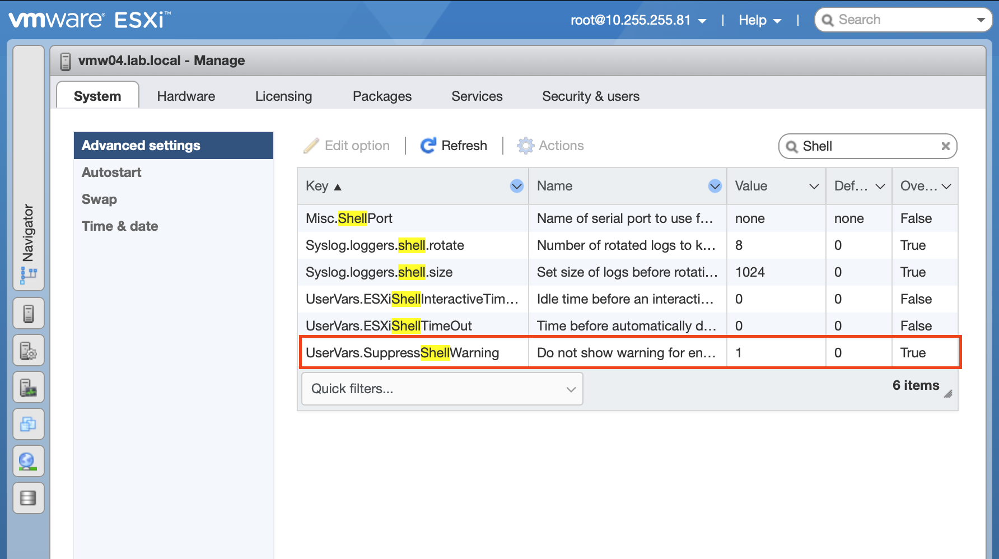

# Vagrant/Ansible Example with VMware

This is an example of using Vagrant to create a Linux VM and then running an Ansible playbook.

## Prerequisites

The following prerequisites are not covered in this README. 

* Vagrant installed locally
* Ansible installed locally
* VMware Hypervisor of either 
    * VMware ESXi 6.x or 7.x Server
    * VMWare Workstation or Fusion

## Hypervisor Setup

### VMware Workstation / Fusion

VMware Workstation / Fusion requires the installation of a Vagrant plugin.

1) Install the `vmware-desktop` plugin for Vagrant.

    ```bash
    # install plugin
    vagrant plugin install vagrant-vmware-desktop
    ```

### VMware ESXi

VMware ESXi requires the installation of a Vagrant plugin.

1) Install the `vmware-esxi` plugin for Vagrant.

    ```bash
    # install plugin
    vagrant plugin install vagrant-vmware-esxi
    ```

Additionally, this automation requires SSH to be enabled on the ESXi host.

2) Enable TSM and TSH-SSH Service.

    

3) Supress Shell Warning (optional)

    If you wish to leave SSH enabled and supress the console warning that it is enabled, adjust the following setting.

    

Furthermore... The VMware ESXi plugin for Vagrant also uses the VMware OVFTOOL to perform it's operations. You can find the download through VMware after a free registration. It will be provided as a zip file. Extract the contents to your desired location and make sure you add it to the machine path that you are running Vagrant from.

4) Update your local machine PATH prior to running any Vagrant commands. 

    ```bash
    export PATH=$PATH:/path/to/ovftool
    ```

5) (Optional) Add the previous line to the relevant OS config file to persist the setup. 

## Vagrant Setup

The `config_example.yml` file contains the configuration options for the environment setup.

1) Create a custom config for your setup.

    ```bash
    cp config_example.yml config.yml 
    ```

2) (If you are deploying to ESXi) Update the `config.yml` with your ESXi host information. 

3) (Optional) Update  the `config.yml` guest machine setup. Additional machines can be specified if required.

4) Add the Guest OS from the Vagrant Repository.

    ```bash
    # or similar VMware compatable Vagrant box, must match value in config.yml
    vagrant box add generic/ubuntu2210 
    ```

## Manage Environment

### Deploy

The following will create each of the VMs that are defined in your `config.yml` and the run the specified Ansible playbook. Each machine will be configured for SSH auth that will be managed by Vagrant.

This command will start the provisioning process and create the VMs based on the configuration specified in the Vagrantfile.

```bash
# deploy automation for vmware workstation/fusion
vagrant up --provider=vmware_desktop

# deploy automation for vmware esxi
vagrant up --provider=vmware_esxi
```

Wait for the provisioning process to complete. This may take some time depending on the complexity of the setup and the speed of your machine.

### Shutdown

This command will gracefully shut down all the VMs that were created using Vagrant.

```bash
# gracefully shutdown all virtual machines
vagrant halt
```

Alternatively, if you want to shut down a specific VM, you can use the following command:

```bash
# gracefully shutdown a specific virtual machine
vagrant halt <vm_name>
```

Replace `<vm_name>` with the name of the VM you want to shut down.

### Remove

To remove the environment and delete all the VMs created with Vagrant, you can use the following command:

```bash
# destroy all vagrant created machines
vagrant destroy -f
```

This command will forcefully remove all the VMs without prompting for confirmation. Make sure to use this command with caution as it cannot be undone.

If you want to remove a specific VM, you can use the following command:

```bash
# destroy a specific vagrant created machine
vagrant destroy -f <vm_name>
```

Replace `<vm_name>` with the name of the VM you want to remove.

After running the `vagrant destroy` command, all the VMs will be deleted and the environment will be completely removed.

Remember to double-check and ensure that you have backed up any important data before executing the `vagrant destroy` command.

## License

The MIT License (MIT)

Copyright (c) 2024

Permission is hereby granted, free of charge, to any person obtaining a copy of this software and associated documentation files (the "Software"), to deal in the Software without restriction, including without limitation the rights to use, copy, modify, merge, publish, distribute, sublicense, and/or sell copies of the Software, and to permit persons to whom the Software is furnished to do so, subject to the following conditions:

The above copyright notice and this permission notice shall be included in all copies or substantial portions of the Software.

THE SOFTWARE IS PROVIDED "AS IS", WITHOUT WARRANTY OF ANY KIND, EXPRESS OR IMPLIED, INCLUDING BUT NOT LIMITED TO THE WARRANTIES OF MERCHANTABILITY, FITNESS FOR A PARTICULAR PURPOSE AND NONINFRINGEMENT. IN NO EVENT SHALL THE AUTHORS OR COPYRIGHT HOLDERS BE LIABLE FOR ANY CLAIM, DAMAGES OR OTHER LIABILITY, WHETHER IN AN ACTION OF CONTRACT, TORT OR OTHERWISE, ARISING FROM, OUT OF OR IN CONNECTION WITH THE SOFTWARE OR THE USE OR OTHER DEALINGS IN THE SOFTWARE.
